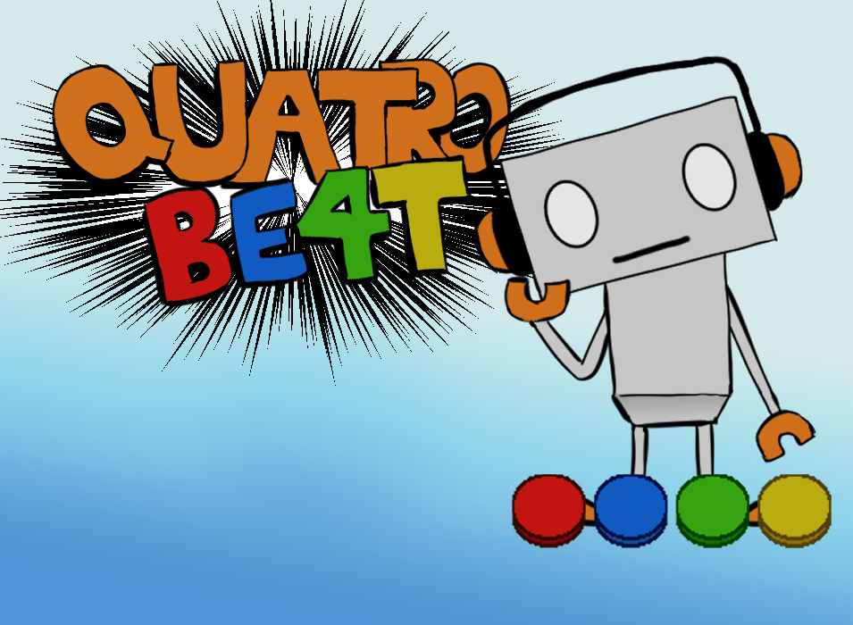

# QUATROBEAT: A Guide
*NOTE: This Java Project was built with the Eclipse IDE with Java 17 and JavaFX 17. This will affect the cloning process. For detailed installation instructions read here.*

   
   
   
   

Welcome to QuatroBeat! A simple four-key rhythm game that also allows you to create charts in-game. 

## Rhythm Game Jargon
note: a circle to be hit by pressing the appropriate key on time
chart: an arrangement of notes aligned to a specific level

## Instructions - Playing the Game 
**KEY BINDS: A S K L** (explained further in game tutorial)

Hit the note on time as it passes through the border.
The better the accuracy, the better the points. 

## Menu (PLAY) 
In the main menu, there are a list of four songs of various difficulties from 1 (easy) to 9 (hard). Click any song to play its chart. 

## Menu (EDIT)
Press the edit button in the bottom left of the menu screen to switch to the edit menu. Here, you can chart your own songs. 

There are four slots to chart songs. If a slot is labelled "NEW SONG", there is no save data for this slot. If a slot has a difficulty and title, there is sava data for this slot. 

### IMPORTING YOUR OWN SONGS
1. In QuatroBeat's files, locate the folder **userAudio**.
2. Import the audio file for your song into this folder.

### CONDITIONS FOR A SONG
A song's length in seconds cannot be more than two digits.

## Instructions - Charting a Song
### Editing Notes
insert a note: press TAB 
delete a note: press BACKSPACE on a note 
move lanes: to insert a note in a different lane, press the LEFT and RIGHT keys

- press "ALL NOTES UP" to move every note on the chart up
- press "ALL NOTES DOWN" to move every note on the chart down 

### Charting Different Parts of the Song
Scroll to traverse through the song. 
Scroll UP to move backward in the song. 
Scroll DOWN to move forward in the song. 

### Play the Song You're Charting 
Press SPACE to start the song at the moment you are at. 
Press SPACE again to stop the song at a specific moment.

Press "PLAY" to start the chart from the beginning. This will imitate how the song will play in-game. 

### Saving the Chart
Press "SAVE" to save the chart in its current status. 

If there is no previous save data for this slot, enter the name, artist, and difficulty of the chart. 

If there is sava data for this slot, save data will be overwritten with what is on the map. 

### Loading the Chart
Press "LOAD" to load a chart. 

If there is no previous save data for this slot, you cannot load a chart. 

If there is save data for this slot, the previously saved data for this slot will show up on the map. This works even if the game is closed and reopened. 

### Returning to Menu
Press "MENU" to return to the edit menu. This will delete any unsaved data. 

### Delete Save Data
1. In QuatroBeat's files, locate the folder **userLevels**.
2. Each save slot aligns to a specific number. For example the top-most save slot saves its data to "0.txt" and the bottom-most save slot save its data to "3.txt". Delete the text file according to its save slot to delete the save slot's save data.

*Have fun playing!*

   

